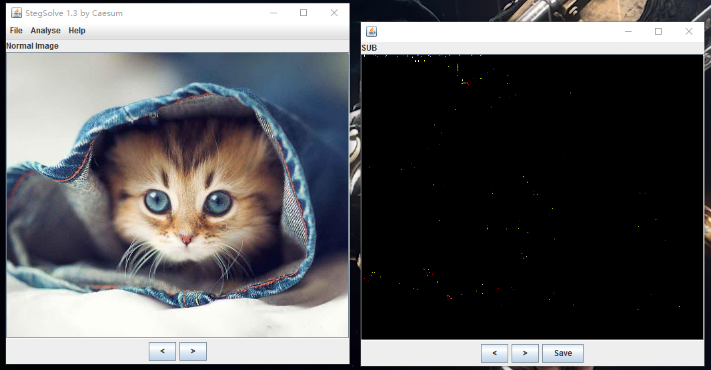

先膜下我们逆向的队友，是真的强，不知道哪位，改天去问问。我就好好学习pwn吧。
再吐槽下这个比赛，脑洞奇大= =

## Trivia

### TR1: Hello there

认识了一个叫做IRC(Internet Relay Chat)的在线聊天室，使用方法简单，起一个Nickname，在同一个Chanel里即可。
顶部就是Flag

`#alexctf: Alexandria University student held capture the flag event ctf.oddcoder.com ALEXCTF{W3_w15h_y0u_g00d_luck}`

## Forensics

### fore1: hit the core

`strings`看一下，发现了一串字符串

```
cvqAeqacLtqazEigwiXobxrCrtuiTzahfFreqc{bnjrKwgk83kgd43j85ePgb_e_rwqr7fvbmHjklo3tews_hmkogooyf0vbnk0ii87Drfgh_n kiwutfb0ghk9ro987k5tfb_hjiouo087ptfcv}
```

然后大家脑洞清奇的发现了所有的大写字母拼起来就是flag

```
strings ='''AeqacLtqazEigwiXobxrCrtuiTzahfFreqc{bnjrKwgk83kgd43j85ePgb_e_rwqr7fvbmHjklo3tews_hmkogooyf0vbnk0ii87Drfgh_n kiwutfb0ghk9ro987k5tfb_hjiouo087ptfcv}'''
flag = ''
for i in range(len(strings)):
    if i % 5 == 0:
        flag += strings[i]
print flag
```

flag`ALEXCTF{K33P_7H3_g00D_w0rk_up}`

### fore2: mail client

看了某个答案，是爆破的，当时没想到，但不觉得是一个好方法
最终结果是`ALEXCTF{Mu77_Th3_CoRe}`
代码：

```
from pwn import *

f = open('string', 'r')
lines = f.readlines()

for i in lines:
    p = remote('195.154.53.62', 2222)
    p.recvuntil('Email:')
    p.sendline('alexctf@example.com')
    p.recvuntil('Password:')
    print i
    p.sendline(i)
    flag = p.recvline()
    if 'Invalid' in flag:
        p.close()
        continue
    else:
        print flag
        p.interactive()
```

`Password: dksgkpdjg;kdj;gkje;gj;dkgv a enpginewognvln owkge  noejne`就是strings了core下

### fore3: usb probing

usb传了一个png，在最大的数据包里能看到，windows有毒，用浏览器打开png才能正常看到

`ALEXCTF{SN1FF_T3H_FL4G_OV3R_USB}`

### fore4: unknown format

里面有一个`.SP01`文件，上网查一下，是kindle的升级包。网上还有一个`kindletool`的工具，可以从这种包中打包和提取文件。

[Kindletool](https://github.com/NiLuJe/KindleTool)

使用过程如下：

```
ubuntu@VM-250-199-ubuntu:~/ctf-problem/2017alexctf/forensics/unknown_format$ ./kindletool dm out flag
ubuntu@VM-250-199-ubuntu:~/ctf-problem/2017alexctf/forensics/unknown_format$ file flag
flag: data
ubuntu@VM-250-199-ubuntu:~/ctf-problem/2017alexctf/forensics/unknown_format$ binwalk flag 

DECIMAL       HEXADECIMAL     DESCRIPTION
--------------------------------------------------------------------------------
254           0xFE            gzip compressed data, from Unix, last modified: 2016-12-31 20:20:49

ubuntu@VM-250-199-ubuntu:~/ctf-problem/2017alexctf/forensics/unknown_format$ binwalk -e flag 

DECIMAL       HEXADECIMAL     DESCRIPTION
--------------------------------------------------------------------------------
254           0xFE            gzip compressed data, from Unix, last modified: 2016-12-31 20:20:49

ubuntu@VM-250-199-ubuntu:~/ctf-problem/2017alexctf/forensics/unknown_format$ ls
flag  _flag.extracted  kindletool  out  usb_sniff.pcap
ubuntu@VM-250-199-ubuntu:~/ctf-problem/2017alexctf/forensics/unknown_format$ cd _flag.extracted/ && ls
FE  FE.gz
ubuntu@VM-250-199-ubuntu:~/ctf-problem/2017alexctf/forensics/unknown_format/_flag.extracted$ tar -zxvf FE.gz
kindle_out/
kindle_out/rootfs_md5_list.tar.gz
kindle_out/2540270001-2692310002.ffs
kindle_out/flag.txt
kindle_out/update-patches.tar.gz

gzip: stdin: unexpected end of file
tar: Unexpected EOF in archive
tar: Unexpected EOF in archive
tar: Error is not recoverable: exiting now
ubuntu@VM-250-199-ubuntu:~/ctf-problem/2017alexctf/forensics/unknown_format/_flag.extracted$ ls
FE  FE.gz  kindle_out
ubuntu@VM-250-199-ubuntu:~/ctf-problem/2017alexctf/forensics/unknown_format/_flag.extracted$ cd kindle_out/
ubuntu@VM-250-199-ubuntu:~/ctf-problem/2017alexctf/forensics/unknown_format/_flag.extracted/kindle_out$ ls
2540270001-2692310002.ffs  flag.txt  rootfs_md5_list.tar.gz  update-patches.tar.gz
ubuntu@VM-250-199-ubuntu:~/ctf-problem/2017alexctf/forensics/unknown_format/_flag.extracted/kindle_out$ cat flag.txt 
ALEXCTF{Wh0_N33d5_K1nDl3_t0_3X7R4Ct_K1ND13_F1rMw4R3}
```

## Scripting

## Script2

找到原图。。比较一下，排除噪音，有不同的地方。



原图：


下面引用别人的答案：

> Some of that is noise. The pixels that look interesting are the 3 rows, where pixels seem to differ at somewhat regular intervals:

> If we print out the x values of these pixels, we get:

> 4 17 36 60 68 85 101 120 132 147 165 180 196 214 231 251 260 275 292 305 325 340 357 371 389 415 420 440 452 473 484 500 4 21 37 63 69 83 100 117 132 147 165 178 196 213 229 244 261 275 293 319 324 340 356 383 388 414 421 436 453 479 485 500 4 24 36 53 69 89 103 125

> Or in hex:

> 04 11 24 3c 44 55 65 78 84 93 a5 b4 c4 d6 e7 fb 104 113 124 131 145 154 165 173 185 19f 1a4 1b8 1c4 1d9 1e4 1f4 04 15 25 3f 45 53 64 75 84 93 a5 b2 c4 d5 e5 f4 105 113 125 13f 144 154 164 17f 184 19e 1a5 1b4 1c5 1df 1e5 1f4 04 18 24 35 45 59 67 7d

> Note that the leading hex character always increments by 1. However, what happens when we look at just the lower 4 bits of each position in hex?

> 414c45584354467b434154535f484944455f534543524554535f444f4e545f544845597d

> That looks like ASCII! It decodes to ALEXCTF{CATS_HIDE_SECRETS_DONT_THEY}.

flag.py

 ```
import binascii
from PIL import Image

new = Image.open('cat_with_secrets.png').load()
old = Image.open('cat_with_secrets_original.jpg').load()

width = 512

in_hex = ''

for y in range(3):
    for x in range(width):
        if (y, x) <= (2, 125) and new[x, y] != old[x, y]:
            in_hex += '%x' % (x % 16)

print(binascii.unhexlify(in_hex))
```

当然了简单的方法，`pip install steganography`，然后run`steganography -d cat-with-secrets.png`