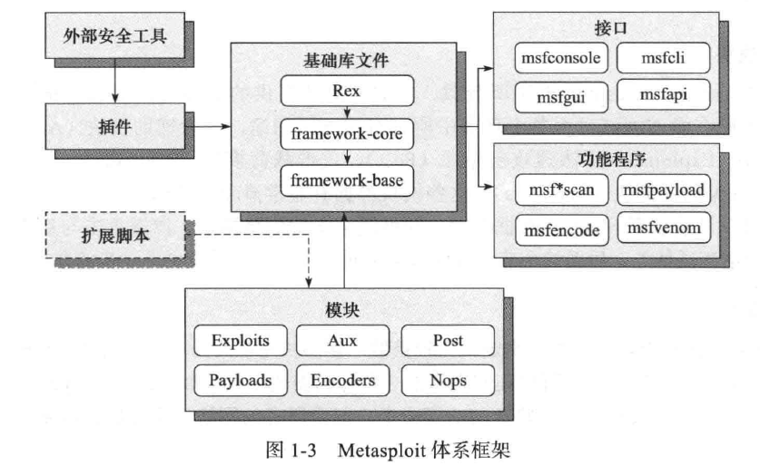

## 体系框架

## 模块

[不错的介绍文章](http://1x0.xyz/archives/whatismetasploit.html)

Metasploit框架的核心，通过多个模块的组装，完成渗透攻击中各个阶段的不同功能。

在metasploit中溢出模块(Exploit)共分为13种，分别是：ais、bsdi、dialup、freebsd、hpux、irix、linux、multi、netware、osx、solaris、unix、windows。其中windows下面的最多。

辅助（Auxiliary）模块共分为13种，分别是admin、client、crawler、dos、fuzzers、gather、pdf、scanner、server、sniffer、spoof、sqli、voip。

加载(payload)模块共分为13种，分别是aix、bsd、bsdi、cmd、generic、java、linux、netware、osx、php、solaris、tty、windows。

### 辅助模块 AUX

主要是渗透测试的信息收集环节，进而帮助攻击者完成更精确的攻击。
同时还包含一些无需加载攻击载荷，但往往不是为了取得目标系统的权限，比如拒绝服务攻击。

### 渗透攻击模块 Exploit

核心功能，又分为主动攻击模块和被动攻击模块，目的是为了获得目标组件的一定的访问权限。
攻击模块又分为多个不同的类别，囊括了主流操作系统和一些分支操作系统。

### 攻击载荷模块 Payloads

具体的完成指定任务的代码，包括**独立**， **传输器**，**传输体**，三种不同的类型。

### 空指令模块 Nops

主要是用来在执行的shellcode前添加添加一大块nop，用来攻击内存随机化，地址偏移等情况。

### 编码器模块 Encoders

通过一定的编码来去掉“坏字符”，和绕过一定的安全防御软件，实现免杀。
同时注意可能会出现找不到合适的payload的情况。

### 后渗透攻击模块 Post

主要用于攻击成功后的工作。比如：内网攻击，本地提权，敏感信息获取等。
Metasploit中的后渗透攻击模块的名字成为Meterpretr。

## 基本攻击

[简洁而基础的一篇文章](http://lmwen.top/2016/08/06/metasploit%E6%B8%97%E9%80%8F%E4%B8%80%E6%9D%A1%E9%BE%99/)

## 常用命令

[metasploit终端命令大全 MSF](https://www.i0day.com/1182.html)

## 关于批量化

msfcli已经不再使用，取而代之的是`msfconsole -x`。同时，使用`mafconsole -r` 可以加载脚本来使用msf。

## 一些小坑

1. msf的更新和安装方式是相关的。在kali上只能用apt-get的方式更新，如果是git得到，可以使用`msfupdate`。如果在kali上用`msfupdate`可能会遇到未知错误。

2. `Failed to connect to the database: could not connect to server: Connection refused`遇到注重错误一般是`postgresql`服务没开，按照[官方回答](https://community.rapid7.com/thread/9302)修改即可。
